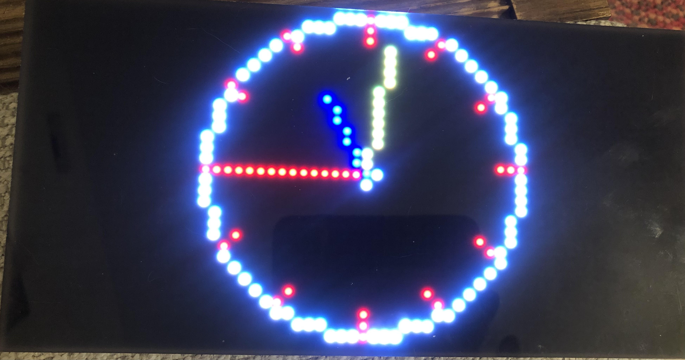

# An analog clock writen for Adafruit M4 Matrix 

Description:

A network based analog clock display written for the Adafruit M4 matirs portal. 
This project was inspired by a Youtube video on Dave's Garage.

While Dave's project was written in C++, this project was implemented in CircuitPython and uses a number of Adafruit's high level libraries. 

Settings Requirements:
  - ssid: Local network SSID
  - password: Local network password
  - timezone: Timezone
  - aio_username: Adafruit IO username
  - aio_key: Adafruit IO secret key

References:
- Dave's Garage: https://www.youtube.com/watch?v=yIpdBVu9xv8
- Adafruit Matrix Portal Library: https://docs.circuitpython.org/projects/matrixportal/en/latest/
- Adafruit Shapes Library: https://docs.circuitpython.org/projects/display-shapes/en/latest/index.html

